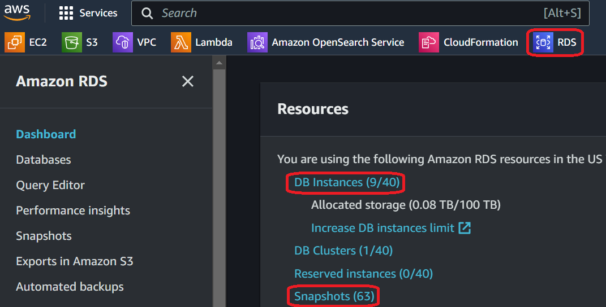
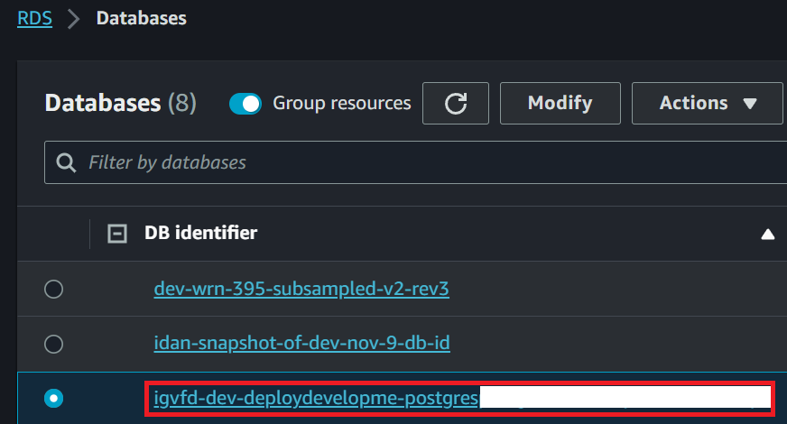
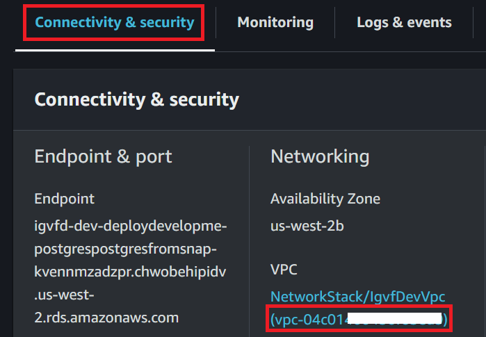
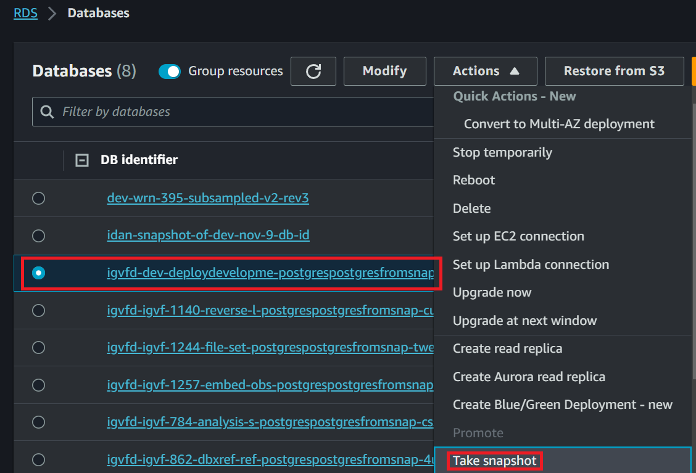
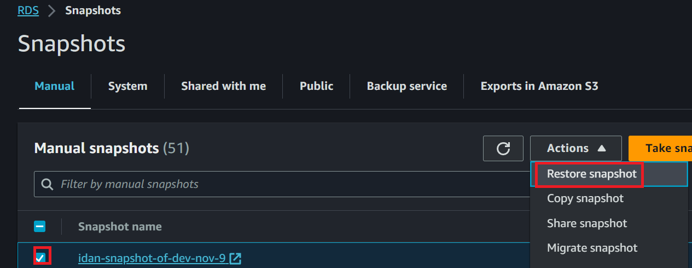
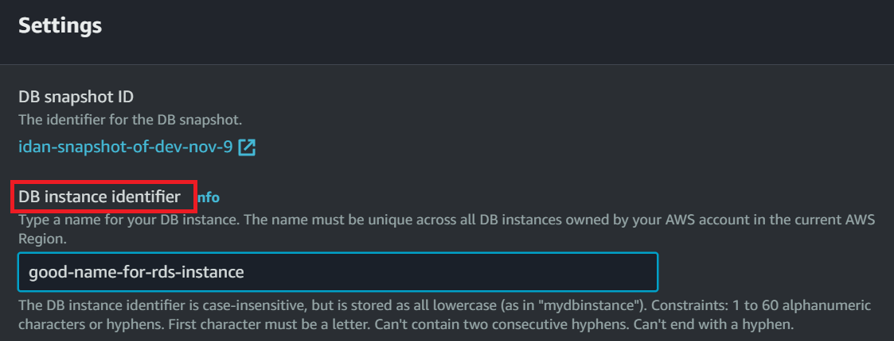
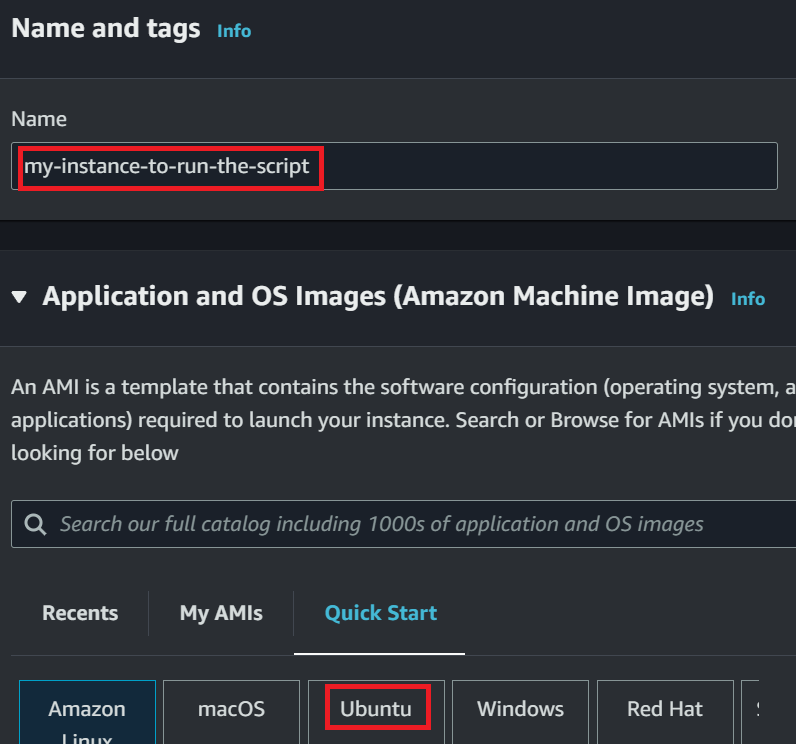
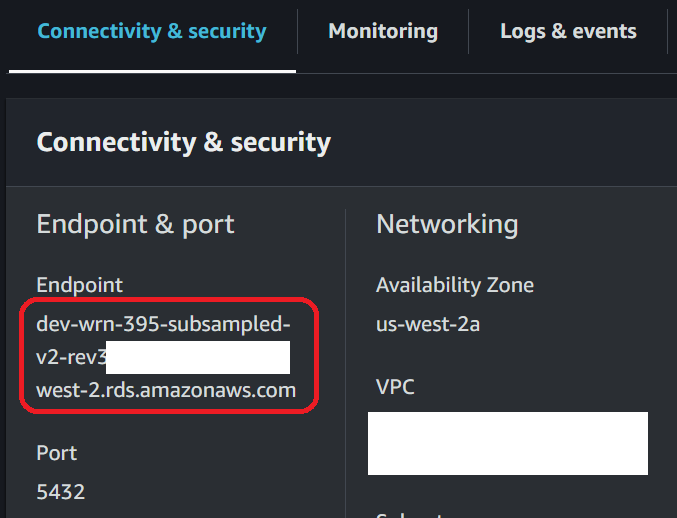
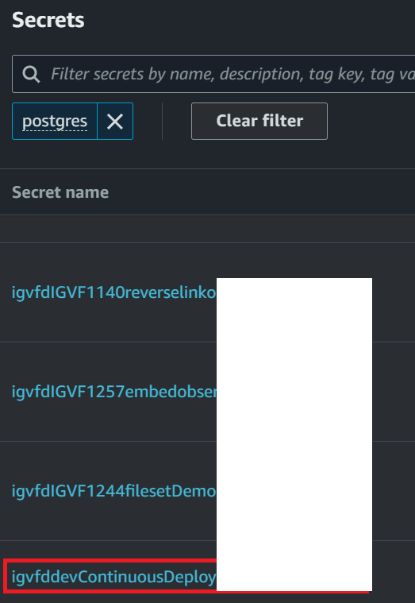

## Setting up environments (RDS instance and EC2 instance)

1) Login on AWS Console and go to [RDS menu](https://us-west-2.console.aws.amazon.com/rds/home?region=us-west-2#databases:)

	

2) Click on `DB Instances` and find a running RDS instance `igvfd-dev-deploydevelopme-XXXXXXX` (or any other instance of interest). This is a base PG DB to be subsampled and we are going to make a copy of it.

	

3) Click on it and copy the VPC ID under `Connectivity & security` tab. This will be used later to create your a new EC2 instance to SSH to the RDS instance.

	

4) Scroll up and click on `Actions` and then `Take snapshot`. Define a new snapshot name and click on `Take snapshot`.

	

5) Go back to [RDS menu](https://us-west-2.console.aws.amazon.com/rds/home?region=us-west-2#databases:) and click on `Snapshots`.

6) Select the created snapshot and click on `Actions` and then `Restore snapshot`. Define a new RDS instance name under `DB instance identifier`. You will be subsampling PG DB on this RDS instance. You cannot directly SSH to an RDS instance. So you need to make a new EC2 instance and SSH to the RDS instance. Key creation is optional. If you want to SSH remotely from your local computer (using `ssh -i key.pem`) then create a new key on AWS console and save private key file `.pem` on your local computer and use it to create an instance. Otherwise you can use any existing key and connect to the instance via AWS Cloud Shell (`Connect` button on EC2 instance's `Action` menu).

	

	

7) Go back to [RDS menu](https://us-west-2.console.aws.amazon.com/rds/home?region=us-west-2#databases:) and click on `DB Instances`.

8) Select an RDS instance that you just created. Click on `Actions` and then `Set up EC2 connection` and then `Create EC2 instance`. Then you will be redirected to EC2 instance creation wizard.

9) Name the EC2 instance and choose `Ubuntu` for OS. Choose `t2.medium` for `Instance type`. Click `Edit` on `Network settings` section and choose the same VPC ID that you copied in `Step-3)`. Click on `Launch instance`.

	

10) Go back to [RDS menu](https://us-west-2.console.aws.amazon.com/rds/home?region=us-west-2#databases:) and click on `DB Instances`.

11) Select a RDS instance that you just created. Click on `Actions` and then `Set up EC2 connection`. Choose an EC2 instance that you just created. click on `Continue`. Scroll to bottom and click on `Set up`.

12) Additionally, click on the RDS instance and copy the value of `Endpoint` under section `Connectivity & security`. This will be used later for `RDS_INSTANCE_HOSTNAME`.

	

12) Go to [Secrets Manager](https://us-west-2.console.aws.amazon.com/secretsmanager/home?region=us-west-2#). Search for `postgres` and select `igvfddevContinuousDeploymen-XXXXXXXXXXX`. Scroll down and find `Secret value` section. Click on `Retrieve secret value`. Copy secret value of key `password`. This is the master password for PG DB and will be used later for `PASSWORD`.

	

13) Go to [EC2 instance menu](https://us-west-2.console.aws.amazon.com/ec2/home?region=us-west-2#Instances:instanceState=running) and click on your EC2 instance. Click on `Connect` to SSH to it.


## Running the subsampler on EC2 instance

1) Login as `ubuntu`. Install Postgresql and start the service.
```bash
$ sudo apt-get update -y
$ sudo apt-get install postgresql python3-pip libpq-dev -y
$ sudo service postgresql start
```

2) Login as `postgres`. and install this tool from pip or github. You are ready to run the tool.
```bash
# Login as postgres
$ sudo su postgres
$ cd

# install the tool from pip
$ pip3 install igvf-subsample-db

# or install the tool from setup.py
$ git clone https://github.com/igvf-dacc/igvf-subsample-db
$ cd igvf-subsample-db
$ python3 setup.py install --user
```

3) Keep logged in as `postgres` for next steps.
```bash
$ sudo su postgres
```

4) (Optional) Create a template rule JSON and edit it. You can also use example rules on `../example/` folder. `PASSWORD` is the PG DB master password that you got from `Secrets Manager`.
```bash
$ create_rule_template -o subsampling_rule.json -d igvfd -P PASSWORD --host RDS_INSTANCE_HOSTNAME
```

5) Create subsample UUIDs CSV file based on the rule JSON.
```bash
$ get_subsampled_uuids subsampling_rule.json -o subsampled.csv -d igvfd -P PASSWORD --host RDS_INSTANCE_HOSTNAME
```

6) Use the CSV file to subsample PG DB.
```bash
$ subsample_pg subsampled.csv -d igvfd -P PASSWORD --host RDS_INSTANCE_HOSTNAME
```

7) Go back to [RDS menu](https://us-west-2.console.aws.amazon.com/rds/home?region=us-west-2#databases:) and select your RDS instance. Click on `Actions` and then `Take snapshot`. This is the final snapshot of subsampled PG DB. Take ARN of this final snapshot and add it to `config.py` in the next steps.


## Creating a new demo machine for testing

1) Create a new branch for `igvfd` and `igvf-ui`(optional) from `dev` branch.

2) Edit [`cdk/infrastructure/config.py`](https://github.com/IGVF-DACC/igvfd/blob/dev/cdk/infrastructure/config.py#L63) of `igvfd`. Replace `snapshot_source_db_identifier` with `snapshot_arn` and paste your final snapshot ARN under the key `snapshot_arn`. This will replace DB snapshot ARN of the `demo` environment. There are two more environments `production` and `dev`, but they are not relevant for this testing so do not edit their DB snapshot sources. Make sure that your branch name used in the item 4) is not `main` or `dev`. `main` and `dev` will use environment `production` and `dev`, respectively.

3) Push all commits to the remote git repo `igvfd`.

4) See [backend documentation](https://github.com/IGVF-DACC/igvfd/tree/dev/cdk) for details about deployment. Deploy with the final DB snapshot.
```bash
$ cdk deploy -c branch=YOUR-BRANCH-NAME --profile igvf-dev
```

5) You may also want to deploy UI [frontend](https://github.com/IGVF-DACC/igvf-ui/tree/dev/cdk) for further testing. Use the same branch name and you don't need to edit anything.
